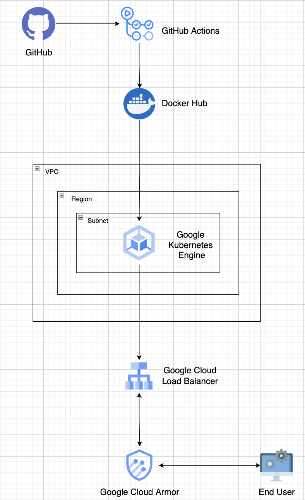

# Web Application Deployment Challenge
- [Web Application Deployment Challenge](#web-application-deployment-challenge)
  - [Design](#design)
    - [Assumptions](#assumptions)
    - [Deployment Strategy](#deployment-strategy)
    - [Non-Functional Requirements Consideration](#non-functional-requirements-consideration)
      - [Scalability](#scalability)
      - [Elasticity](#elasticity)
      - [Availability](#availability)
      - [Security](#security)
      - [Maintainability](#maintainability)
  - [Implementation](#implementation)
    - [\[DevOps Team\] Setting up the Infrastructure](#devops-team-setting-up-the-infrastructure)
    - [\[Dev Team\] Pushing code](#dev-team-pushing-code)
  - [Recommendations](#recommendations)
  - [References](#references)

## Design

The architecture is tailored for a web service on the brink of its launch, transitioning from local development to gaining access to the wider internet. The design ensures that developers working on APIs can concentrate on their development tasks without the added concern of deployment hassles.

### Assumptions
- The company is presumed to possess a Google Cloud Platform's GKE Enterprise License[[1]](#1), and all the scripts have been implemented accordingly.
  
- Following the deployment of the GKE cluster, it is assumed that load tests on the Kubernetes (K8) pods have been conducted using standard load testing procedures[[2]](#2). The results indicate that each pod can effectively handle up to 300 concurrent users.

- In the context of the hypothetical performance testing mentioned above, the choice of `n1-standard-4`[[3]](#3) for nodes is assumed to be suitable for accommodating extreme loads, featuring 4 vCPUs and 15GB of memory.

- It is assumed that a minimum of 3 nodes and a maximum of 10 nodes are necessary to run the application. These values are incorporated into the autoscaling configuration.

- The update strategy for the deployment assumes a rolling update approach, with max surge and max unavailable set to 1.

- The web service is considered an API-as-a-service and is assumed not to have a domain linked to it. Consequently, GKE's load balancer is expected to generate a public IP for users to utilize.

- Docker Hub is assumed to be the preferred container registry for the company, and the image is hosted at sankalpgunturi/ready[[4]](#4).

- It is assumed that the service account key, GCP project ID, Docker username, and Docker password are stored in the environment of the repository. For larger organizations with numerous developers, additional considerations for secure credential management may be necessary.

- A dummy IP is provided in the security rules to illustrate the concept of denying requests in the [waf.tf](waf.tf) file.

### Deployment Strategy

Establish the infrastructure outlined in the [implementation](#devops-team-setting-up-the-infrastructure) section. A GKE cluster is created in the [designated region](terraform.tfvars#L2), accompanied by custom node pools within the same region. Security policies are defined for all resources associated with the cluster, and a dedicated subnet is generated to facilitate internal resource access. The Kubernetes (K8) workload is deployed, leveraging the Docker image specified in the earlier assumptions[[4]](#4).

A load balancer is then instantiated to evenly distribute traffic among the pods, and its external IP serves as the gateway to the API-as-a-Service. 

Developers contribute changes to files in the [api](api) directory as outlined [here](#dev-team-pushing-code). During their integration window, when they opt to push changes to the main branch, the [GitHub Workflow](.github/workflows/deploy.yml) is automatically triggered.

This GitHub Workflow involves the sequential steps of checking out the repository, building the Docker image, pushing it to Docker Hub, and orchestrating the K8 deployment update through a delete and redeploy mechanism.

### Non-Functional Requirements Consideration
#### Scalability
- **Need**: To gracefully handle a minimum of 1000 concurrent users during launch.
- **Mechanism**: Employing Auto-scaling within the GKE's cluster's node pool. This entails the automatic provisioning of additional worker nodes to efficiently manage extreme loads as needed.
- **Relevant Implementation**: [main.tf](main.tf#L37)

#### Elasticity
- **Need**: To dynamically scale based on demand.
- **Mechanism**: Implementing Horizontal Pod Autoscaling. This configuration allows the system to seamlessly adjust the number of pod replicas, automatically adapting to fluctuations in user demand, whether it requires scaling up or down.
- **Relevant Implementation**: [hpa.tf](hpa.tf)

#### Availability
- **Need**: To maintain high availability amid server/network anomalies.
- **Mechanism**: Deploying the GKE cluster in a specified region with multiple zones. By default, GKE distributes nodes across these zones, ensuring high availability. This design choice is critical for sustaining operational functionality even in the event of issues affecting a particular zone.
- **Relevant Implementation**: [main.tf](main.tf#L17)

#### Security
- **Need**: To withstand deliberate DoS attacks.
- **Mechanism**: Integrating Google Cloud Armor and establishing a rudimentary security policy to ensure resilience against Denial of Service (DoS) attacks.
- **Relevant Implementation**: [waf.tf](waf.tf#L9)

#### Maintainability
- **Need**: To accommodate periodic service updates with minimal downtime.
- **Mechanism**: 
  - Utilizing "rolling updates" ensures a seamless transition during updates between pods, minimizing service disruptions.
  - Utilizing a GitHub Actions workflow set to trigger when a developer pushes changes to the main branch as described in the [deployment strategy](#deployment-strategy).
- **Relevant Implementation**: [deployment.yaml](infra/deployment.yaml#L23), [deploy.yml](.github/workflows/deploy.yml)

The implementation of these mechanisms collectively ensures the reliability and robustness of the system.

## Implementation

### [DevOps Team] Setting up the Infrastructure
1. Use `gcloud auth application-default login` to authorize and obtain application default credentials for authenticating API requests.

2. Initialize Google Cloud configurations with `gcloud init` to set up the default project, region, and other settings interactively.

3. Execute `terraform init` to initialize the Terraform configuration, downloading necessary providers and modules.

4. Run `terraform plan -out=saved_plan` to generate and save a detailed execution plan, previewing the changes that will be applied.

5. Apply the infrastructure changes using `terraform apply` based on the saved plan, deploying the defined resources and configurations.

### [Dev Team] Pushing code
1. Modify files within the [api](api) folder to implement desired code changes.

2. Commit the changes using Git, followed by pushing them to the main branch.

3. Monitor the GitHub repository's workflows, to track the progress and outcomes of the automated processes triggered by the code push. It should be all green such as [this](https://github.com/sankalpgunturi/web-application-deployment/actions/runs/7015415535/job/19084704630).

## Recommendations
- I believe the existing infrastructure is solid, the Dockerfile does a good job. The use of multi-stage builds is a best practice in Dockerfiles. It allows you to use a larger image with build tools and dependencies during the build phase but produce a smaller image in the final stage that only contains the necessary runtime dependencies and the application code. 

- As an extension to my implementation, I would suggest exploring Fleet Management[[5]](#5)[[6]](#6), a new addition to GCP's infrastructure. This feature offers the capability to manage multiple GKE clusters and facilitates load balancing between them. Leveraging fleet management becomes particularly advantageous as the user concurrency increases, enhancing the overall reliability of the system.

## References
<a id="1">[1]</a> [More about GKE Licences](https://cloud.google.com/kubernetes-engine/pricing)

<a id="2">[2]</a> [Standard ways of load testing](https://speedscale.com/blog/kubernetes-load-testing/)

<a id="3">[3]</a> [More on GCP Machine Resources](https://cloud.google.com/compute/docs/machine-resource)

<a id="4">[4]</a> [Custom Docker Image I made for this challenge](https://hub.docker.com/repository/docker/sankalpgunturi/ready/general)

<a id="5">[5]</a> [Introduction to Fleet Management in GKE](https://cloud.google.com/anthos/fleet-management/docs/fleet-concepts)

<a id="6">[6]</a> [Fleet Management Hands-on](https://cloud.google.com/anthos/fleet-management/docs/register/gke)

